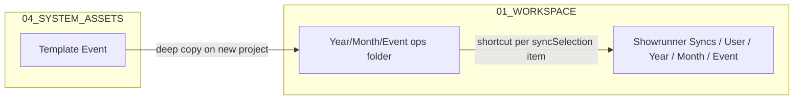

# Google Drive layout (`STAGE_MASTERS_SYSTEM_ROOT`)

**Entry:** [AI_DOCTRINE.md](../../AI_DOCTRINE.md) · **Database ops:** [topics/database-ops.md](topics/database-ops.md) · **Code:** `Resources_Core.js`, `Resources_Database.js`, `Integrations.js`

**Last updated:** 2026-06-30 · **Source:** Director Drive screenshots + folder IDs · **Host:** Google Workspace (in-place upgrade on same account — IDs unchanged)

Canonical map of host Drive layout, **live database file names**, backup/archive naming, and **Showrunner Sync** (shortcut mirror — not backup).

**Year archive to NAS (policy):** Keep **current + previous year** on Google Drive; years **≤ current − 2** sync one-way to Synology — [topics/drive-nas-year-archive.md](topics/drive-nas-year-archive.md). Requires [Workspace host](topics/workspace-migration.md).

---

## Folder ID registry

| Drive path | Folder ID | Code constant (target) | Notes |
|------------|-----------|------------------------|-------|
| **`STAGE_MASTERS_SYSTEM_ROOT`** | `1YVNMQRIq7FrRSeD2MuQO0zNSXR0XeTsc` | `SYSTEM_ROOT_ID` | Host root — Workspace host My Drive (in-place upgrade) |
| **`05_DATABASE`** | `1EAgUzjbwq5CootjKmZhQP3Mfm2VYsZox` | `LIVE_DATABASE_FOLDER_ID` | Live spreadsheets + lifecycle subfolders |
| **`05_DATABASE/REPLACED`** | `1aZSru-d8OryHpNCooPm78oWdFjSauTPN` | `REPLACED_DB_FOLDER_ID` | Confirmed |
| **`05_DATABASE/ARCHIVES`** | `1KFhrzhwxuMocMQzW9DfWc5QcO-_Pg81z` | `ARCHIVE_FOLDER_ID` | Confirmed |
| **`05_DATABASE/BACKUPS`** | `1yVRU7ZsYwrazsIkSlt0-afYFLWtScMre` | `DB_BACKUP_FOLDER_ID` | **Resolve by name** inside `05_DATABASE` first; constant is reference only |
| **`01_WORKSPACE`** | `1MDjRCK5RyILVly1Rv7J9yxjr2BLDrFYl` | `WORKSPACE_FOLDER_ID` / `OPS_ROOT_ID` | Event trees + `Showrunner Syncs` |
| **`02_FINANCE`** | `1oGZS3yvrZXebYBlwE0eNq0JMPKbR48y6` | `FINANCE_FOLDER_ID` / `FIN_ROOT_ID` in `Integrations.js` | Finance year/event mirrors — **confirmed** |
| **`03_SAFETY_VAULT`** | — | — | Empty — reserved |
| **`04_SYSTEM_ASSETS`** | `1PL16v5ZbyX5KzxqGEnaDpp1fVmcp5ecl` | `SYSTEM_ASSETS_FOLDER_ID` | Parent of template folders |
| **`04_SYSTEM_ASSETS/Template Event`** | `19J-3qT7ABLIRK7Si1xfp_KEPRQYcbKbe` | `OPS_TEMPLATE_ID` in `Integrations.js` | Ops template — deep-copied into new event folders |
| **`04_SYSTEM_ASSETS/Template Finance`** | `1qmchnnh21Lp3iPR73B_LV6oihbiTJSwW` | `FIN_TEMPLATE_ID` in `Integrations.js` | Finance template — deep-copied into new finance folders |

> **AI rule:** Resolve folders by **ID constants** above. Never `createFolder` at system root. Never rename live database files except to restore director-approved canonical names below.

---

## Tree (director layout)

```
STAGE_MASTERS_SYSTEM_ROOT/
├── 01_WORKSPACE/
│   ├── Showrunner Syncs/          ← per-user shortcut mirrors (see § Sync)
│   │   └── [Crew Name]/
│   │       └── [Year]/[Month]/[Event folder]/
│   │           └── shortcuts → real files in event ops folder
│   └── [Year]/                    ← real ops project folders (e.g. 2026/…)
├── 02_FINANCE/
│   └── [Year]/                    ← real finance mirrors
├── 03_SAFETY_VAULT/               ← empty (reserved)
├── 04_SYSTEM_ASSETS/
│   ├── Template Event/            ← cloned into new ops event folders
│   └── Template Finance/          ← cloned into new finance event folders
└── 05_DATABASE/
    ├── SM_Showrunner_ENGINE       ← live transactional DB
    ├── SM_Showrunner_VAULT        ← live master data DB
    ├── SM_Showrunner_LOGS         ← live audit log workbook
    ├── SM_Showrunner_AUDIT        ← live audit studio DB
    ├── BACKUPS/
    ├── REPLACED/
    └── ARCHIVES/
```

---

## Live database files (canonical names)

All four live spreadsheets sit **directly in `05_DATABASE`** (not in subfolders). Naming pattern:

**`SM_Showrunner_<ROLE>`** — same family as Logs and Audit.

| Canonical Drive name | App role | Script property | Factory fallback ID |
|---------------------|----------|-----------------|---------------------|
| **`SM_Showrunner_ENGINE`** | Transactional DB (projects, timeline, tasks, logistics sheets) | `ACTIVE_ENGINE_SHEET_ID` | `1AIa5GuEq4J4mDUqfI2Sp5RkAt6RW-aUd3VG0anB-PFk` |
| **`SM_Showrunner_VAULT`** | Master data (crew, assets, IAM, `System_Config`) | `ACTIVE_VAULT_SHEET_ID` | `1EzqvZQM5VanEB1_XxZT7lRd8YfXSTMcBVRVx3mGElz8` |
| **`SM_Showrunner_LOGS`** | Enterprise audit log (`writeToAuditLog`) | `ACTIVE_AUDIT_LOG_SHEET_ID` | `1gR70dun6Xc4Q_njxd2PXrT9rty_1X_4qiZby8V4RyOA` |
| **`SM_Showrunner_AUDIT`** | External audit / duplicate-scan DB | `ACTIVE_AUDIT_DB_SHEET_ID` | `1UdEONWScrTQSoa_spIEjfN3lJdMcxu9zLCXVZZcJbG8` |

**Registry:** App uses **file ID** in Script Properties (`getEngineSheetId()`, etc.). Fallback IDs apply only when a property is unset.

**v354–355 mistake (resolved):** Repair/restore code once renamed Engine/Vault to bare `ENGINE` / `VAULT`. Director layout requires **`SM_Showrunner_ENGINE`** and **`SM_Showrunner_VAULT`** — code is now **aligned** (`LIVE_ENGINE_FILE_NAME = 'SM_Showrunner_ENGINE'` in `Resources_Core.js`; see *Known code drift* below).

---

## Naming conventions — backups (`05_DATABASE/BACKUPS`)

| Pattern | Example | Created by |
|---------|---------|------------|
| `ENGINE_BACKUP_YYYY-MM-DD` | `ENGINE_BACKUP_2026-06-28` | Nightly trigger, BOTH backup, quick ENGINE backup |
| `VAULT_BACKUP_YYYY-MM-DD` | `VAULT_BACKUP_2026-06-28` | Same for Vault |
| `ENGINE_BACKUP_YYYY-MM-DD_<ms>` | manual quick backup same day | `backupDatabaseFileCore_` timestamp suffix |
| `VAULT_BACKUP_YYYY-MM-DD_<ms>` | same | same |

- **Pairs:** Health check expects Engine + Vault backups sharing the same date (`computeBackupHealthReport_`).
- **Retention:** Files older than **30 days** pruned on nightly run (`BACKUP_RETAIN_DAYS`).
- **Restore:** Copy from `BACKUPS` → live slot in `05_DATABASE` as **`SM_Showrunner_ENGINE`** / **`SM_Showrunner_VAULT`**; previous live moved to `REPLACED`.
- **Backups are never moved** — only copied from; dated names stay in `BACKUPS`.
- **Legacy:** v354–355 briefly wrote to `05_DATABASE/05_DATABASE_BACKUPS` — code still **scans** that folder for old copies but **writes** only to `BACKUPS` (`DB_BACKUP_FOLDER_ID`).

---

## Naming conventions — replaced (`05_DATABASE/REPLACED`)

When live Engine or Vault is swapped on restore:

| Pattern | Meaning |
|---------|---------|
| `ENGINE_REPLACED_YYYY-MM-DD_HHMM` | Previous live Engine moved aside |
| `VAULT_REPLACED_YYYY-MM-DD_HHMM` | Previous live Vault moved aside |
| `ENGINE_SUPERSEDED_…` | Wrong live file after a **revert** operation |
| `ENGINE_STALE_SLOT_…` | Orphan file that occupied canonical name during repair |

Files **accumulate** here (not auto-deleted). Revert can promote a `REPLACED` file back to live.

---

## Naming conventions — archives (`05_DATABASE/ARCHIVES`)

| Pattern | Created by | Purpose |
|---------|------------|---------|
| `AUDIT_LOGS_ARCHIVE_YYYY-MM-DD` | `runMonthlyLogArchive` | Google Sheet — audit rows older than 60 days |
| `ENGINE_COLD_ARCHIVE_YYYY-MM-DD` | `runYearlyEngineArchive` | Full Engine copy when 18‑month purge runs |

Log archiver also referenced creating sheets at Drive root before move — target folder is **`ARCHIVES`** (`ARCHIVE_FOLDER_ID`).

---

## Showrunner Sync (Drive shortcuts — **not** backup)

This is what managers configure in **Personal Hub → Drive Folder Automation → sync checkboxes**. It is **separate** from database backup/restore.

### What it does

1. **Real project folders** are created under **`01_WORKSPACE/[Year]/[Month]/[Event name date range]`** (and finance mirror under **`02_FINANCE`**). Templates from **`04_SYSTEM_ASSETS/Template Event`** (and Template Finance) are **deep-copied** into those folders on first project save (`generateProjectFolders` in `Integrations.js`).

2. **Per-manager config** (vault JSON `manager_config_{crew}`) stores:
   - `syncSelection` — array of **template item names** (files/folders) the manager wants in their personal mirror
   - `renameRules` — optional prefix/suffix when shortcut display name uses project name

3. **`Showrunner Syncs` hub** under **`01_WORKSPACE`**:
   ```
   01_WORKSPACE/Showrunner Syncs/[Crew Name]/[Year]/[Month]/[Event folder name]/
   ```
   For each checked template item, the code:
   - Finds the **real** file or folder inside the **ops event folder** (by name, after template clone + file rename rules)
   - Creates a **Google Drive shortcut** (`DriveApp.createShortcut`) pointing at that real item
   - Places the shortcut in the user's mirrored `…/[Event folder]/` path
   - Grants the user **editor** on the underlying real file (not a copy)

4. **Triggers:**
   - **On new project save** — `generateProjectFolders` runs mirrored sync for **all managers** on the roster who have `syncSelection` set
   - **Manual retroactive** — `runRetroactiveDriveSync(crewName)` walks **all existing projects** and adds **missing** shortcuts only (skips if shortcut already exists)

5. **What sync is NOT:**
   - Not copying database spreadsheets
   - Not syncing `05_DATABASE` files
   - Not replacing the real event folder — shortcuts are **links**; delete shortcut ≠ delete master file
   - Desktop Google Drive shows shortcuts in the user's sync folder; they open the real ops file

### Flow diagram



### Code entry points

| Function | File | When |
|----------|------|------|
| `generateProjectFolders` | `Integrations.js` | Project save — folders + shortcuts |
| `runRetroactiveDriveSync` | `Integrations.js` | Manager runs retroactive sync from hub |
| `getManagerConfig` / `syncSelection` | `Resources_System.js` | Per-manager vault JSON |
| Hub UI checkboxes | `06e_Admin_Automation.html` | Manager selects items to sync |

**Code note:** Sync hub parent is `OPS_ROOT_ID` (`01_WORKSPACE`). Folder name in code: **`Showrunner Syncs`** (with space and plural).

---

## Database backup vs Drive sync (quick contrast)

| | **Database backup** | **Showrunner Sync** |
|--|---------------------|---------------------|
| **What** | `SM_Showrunner_ENGINE` + `VAULT` spreadsheets | Event template files/folders |
| **Where** | `05_DATABASE/BACKUPS` | `01_WORKSPACE/Showrunner Syncs/…` |
| **Mechanism** | `makeCopy` with dated name | `createShortcut` to real ops file |
| **Config** | ROOT DATABASE tab / nightly cron | Manager `syncSelection` checkboxes |
| **Module** | `Resources_Database.js` | `Integrations.js` |

---

## Known code drift

| Item | Status |
|------|--------|
| Folder IDs in `Resources_Core.js` | **Aligned** with director registry (v356) |
| Live names `SM_Showrunner_ENGINE` / `VAULT` | **Aligned** in restore/repair |
| `BACKUPS` folder by ID | **Aligned** — `DB_BACKUP_FOLDER_ID` |
| Stray `01_DATABASE` folder | Director may delete manually if still present |
| `03_SAFETY_VAULT` ID | Not registered — folder empty |

---

## Still needed from director

| Priority | Item |
|----------|------|
| **P2** | `03_SAFETY_VAULT` folder ID (empty — registry only) |

**Folder ID registry complete** for all active code paths: root, `01_WORKSPACE`, `02_FINANCE`, `04_SYSTEM_ASSETS`, templates, `05_DATABASE`, `BACKUPS`, `REPLACED`, `ARCHIVES`.

---

## How this doc connects (AI doctrine graph)

Single source of truth for **host Drive layout**. Other docs **link here** — they do not copy the full tree.

```
AGENTS.md ──► AI_DOCTRINE.md ──► docs/ai/README.md (drawer map)
                    │
                    ├── DRIVE_LAYOUT.md  ◄── YOU ARE HERE (folder IDs, names, sync vs backup)
                    │
                    ├── ARCHITECTURE.md §9 ──► link only (Drive sync mechanics summary)
                    ├── GLOSSARY.md ──► one-line pointer
                    ├── FILE_MAP.md ──► code modules ↔ Integrations / Resources_*
                    └── topics/database-ops.md ──► backup/restore backlog + link
```

| If you change… | Update in same session |
|----------------|------------------------|
| Folder ID or live file name | This file + `Resources_Core.js` (+ `Integrations.js` if templates/ops/fin roots) |
| Backup/restore behaviour | `topics/database-ops.md` + `Resources_Database.js` |
| Showrunner Sync shortcuts | This file § Sync + `Integrations.js` + `06e_Admin_Automation.html` |
| Ship to production | `RELEASES.md` via `node milestone.js` — [DEPLOY_AND_ROLLBACK.md](DEPLOY_AND_ROLLBACK.md) |

**Code constants (registry — aligned in `Resources_Core.js`):**

| Constant | ID |
|----------|-----|
| `SYSTEM_ROOT_ID` | `1YVNMQRIq7FrRSeD2MuQO0zNSXR0XeTsc` |
| `WORKSPACE_FOLDER_ID` / `OPS_ROOT_ID` | `1MDjRCK5RyILVly1Rv7J9yxjr2BLDrFYl` |
| `FINANCE_FOLDER_ID` / `FIN_ROOT_ID` | `1oGZS3yvrZXebYBlwE0eNq0JMPKbR48y6` |
| `SYSTEM_ASSETS_FOLDER_ID` | `1PL16v5ZbyX5KzxqGEnaDpp1fVmcp5ecl` |
| `OPS_TEMPLATE_ID` | `19J-3qT7ABLIRK7Si1xfp_KEPRQYcbKbe` |
| `FIN_TEMPLATE_ID` | `1qmchnnh21Lp3iPR73B_LV6oihbiTJSwW` |
| `LIVE_DATABASE_FOLDER_ID` | `1EAgUzjbwq5CootjKmZhQP3Mfm2VYsZox` |
| `DB_BACKUP_FOLDER_ID` | `1yVRU7ZsYwrazsIkSlt0-afYFLWtScMre` |
| `REPLACED_DB_FOLDER_ID` | `1aZSru-d8OryHpNCooPm78oWdFjSauTPN` |
| `ARCHIVE_FOLDER_ID` | `1KFhrzhwxuMocMQzW9DfWc5QcO-_Pg81z` |

---

## Maintenance

Update this file and matching constants in `Resources_Core.js` / `Integrations.js` in the same session when IDs or names change. Link from `ARCHITECTURE.md` §9 — do not duplicate the full tree there.
