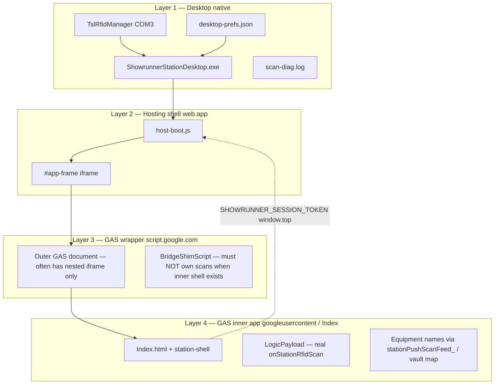
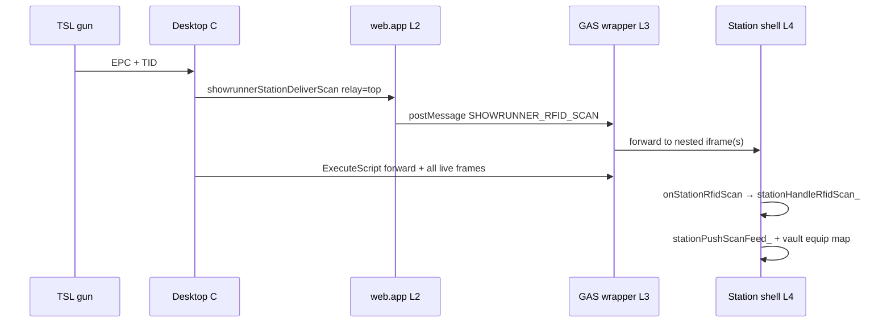

# TSL desktop station — handoff & architecture

**Purpose:** Single entry for new Cursor chats on the **TSL 1128 gate PC** (`tsl_dock_desktop`). Read this before touching `station-desktop/` or desktop-specific paths in `host-boot.js` / `Index.html`.

**Parent campaign:** [rfid-station-profiles.md](rfid-station-profiles.md) · **Fragile rules:** [FRAGILE_ZONES.md](../FRAGILE_ZONES.md) § Two-layer shell bridge · § Desktop WebView2 station · § TSL 1128 desktop gun driver · **App readme:** [station-desktop/README.md](../../../station-desktop/README.md)

**Last updated:** 2026-07-11 · **Field status:** **Working** — station login/logout, auto pin, RFID scans show **equipment name + unit #** in the real station UI (Scan panel / live strip), crew badge host flow.

**Director launch:** always **`station-desktop/RUN-STATION.bat`** (never an old exe in a legacy publish folder).

---

## One-line brief for a new chat

> TSL 1128 desktop gate PC (`tsl_dock_desktop`). WPF + WebView2 thin shell runs the **same** station web UI as Chainway. Gun = COM3 Bluetooth TSL. Scans and session cross **four WebView layers** (desktop → web.app → GAS wrapper → GAS inner app). **Do not** “fix” scans by hitting only the outer GAS frame or by re-enabling sync `hostObjects` on the UI thread. Read this file + [FRAGILE_ZONES.md](../FRAGILE_ZONES.md) § Desktop WebView2 before code. Say **OK go** before changes.

---

## Versions (verified working 2026-07-11 — see REWIND doc for pins)

**Major rewind before UI rework:** [REWIND-pre-station-ui-split.md](REWIND-pre-station-ui-split.md)

| Layer | Version | Notes |
|-------|---------|--------|
| **Desktop EXE** | **0.1.44** | Cold start clears host; settings + sleep/reconnect relay (0.1.41–43) |
| **GAS** | **RELEASES.md REWIND row** | Monolithic `11_Station_Shell.html` — last baseline before split |
| **Hosting** | `host-boot.js?v=499` | `SR_STATION_GUN` relay; desktop host session clear on init |
| **Chainway APK** | **0.1.51 (build 53)** | Sled phone — separate track; see REWIND doc |
| **Profile layout** | `tsl_dock_desktop` | One station profile per gate PC device account |

Build / deploy:

```bash
# Desktop (gate PC or dev machine)
station-desktop/RUN-STATION.bat          # taskkill + publish + start
node build-station-desktop.js "<notes>"  # release zip

# Web (only when GAS/hosting changed)
node milestone.js "<note>"
node deploy-hosting.js "<note>"          # if host-boot.js changed
```

---

## Architecture — four layers (not two)

The station **looks** like one fullscreen app. Under WebView2 it is **four documents**:



| Layer | What the operator sees | What code runs there |
|-------|------------------------|----------------------|
| **1 Native** | Status bar, F12 diagnostics | COM gun, `DeliverScanToPage`, session file |
| **2 web.app** | (Usually invisible chrome) | `showrunnerStationDeliverScan` → `postMessage` into `#app-frame` |
| **3 GAS wrapper** | **Grey “Live RFID scans” box** if miswired | Emergency shim only — **no** `#station-shell` |
| **4 GAS inner** | Profile name top-left, Scan panel, host badge prompt | Real station shell, host login, equipment name resolution |

**Android Chainway uses the same layers 2–4** but one WebView hides the split. Desktop **must** treat WebView2 **child frames** explicitly.

---

## Session path (login / auto pin / sessionboot)

**Symptom we debugged for weeks:** UI shows logged-in station profile + auto 6-digit pin, but logs said `sessionboot check: {"skip":"no-session"}`.

**Cause:** Session token lived in **layer 4** (`localStorage` in inner Index) but `postSessionToParent()` only posted to **`window.parent`** (layer 3 wrapper). Desktop prefs and web.app parent never received the token → `sessionboot` never ran from hosting.

**Working path (v525 + v0.1.38+):**

1. Operator logs in (or auto pin) in **layer 4** → `sm_session_token` in iframe storage + meta tags.
2. `Index.html` / `Login.html` call `AndroidStation.saveSession` (native prefs) **and** `postMessage` to **`window.parent` and `window.top`** (`SHOWRUNNER_SESSION_TOKEN`).
3. **Layer 2** `host-boot.js` `saveParentSession` → parent `localStorage` + `AndroidStation.saveSession` on top frame.
4. **Layer 1** `StationBridge.saveSession` → `%LOCALAPPDATA%\ShowrunnerStation\desktop-prefs.json` (deduped — Index pings every 1.5s must not spam saves).
5. When parent has token: iframe navigates to `?action=sessionboot&token=…` → server validates → full Index boot → LogicPayload loads.

**Fragile:**

- Do **not** clear parent session on desktop station kiosk (`isDesktopAutoLoginOff` false for `ShowrunnerStation` UA).
- Do **not** schedule unlimited sessionboot retries on every save — use `_sessionBootChecksScheduled` / stop sync timer after boot.
- **`SHOWRUNNER_STATION_READY`** only when `full: true` from `stationAnnounceReady_()` — early boot in `build.js` must **not** notify native shell ready.

---

## Scan delivery path (gun → equipment name in UI)

**Success criterion:** Scan panel / live strip shows **“Robin WashBeam #20”** (resolved name), not raw EPC hex. Grey box at bottom = **wrong layer**.



**Primary (match Android):** `RelayScanToTopHosting` → `showrunnerStationDeliverScan` in **layer 2**.

**Required for desktop:** GAS **wrapper** forwards `postMessage` into **nested** iframes (`__srForwardScanToNested_` in `BridgeShimScript`). Without this, layer 2 only talks to layer 3.

**Direct frame invoke:** Run `BuildInvokeScanJs` on **all** live `CoreWebView2Frame`s; prefer result `ok` or `forwarded` over `shim`. Treat `shim` as wrong frame / emergency handler.

**Never rely on alone:**

- `ExecuteScript` on the first `script.google.com` frame only (hits wrapper → grey box).
- `postMessage` without nested forward.
- Top-frame `pollScans()` on WebView2 (disabled in `host-boot.js` — would steal queue from iframe).

**Dedupe:** 1.5s native + web (`ShouldDeliverScanToWeb`, `__srDedupeScan_`).

---

## Grey box vs real station UI

| UI element | Layer | Meaning |
|------------|-------|---------|
| Station profile name top-left | 4 | Real `#station-shell` |
| “Scan your crew badge” | 4 | Host-empty state — working |
| **Scan** menu → Live RFID scans | 4 | Real feed (`#station-scan-panel`) |
| **Grey bar “Live RFID scans”** bottom | 3 (or wrong frame) | **`#sr-desktop-scan-feed` emergency shim** — not success |

Shim is allowed **only** before inner shell exists (pre-login). If operator sees profile name **and** grey box, delivery is still hitting layer 3 — do not ship.

---

## How the director runs the app

```text
station-desktop/RUN-STATION.bat
```

1. `taskkill /F /IM ShowrunnerStationDesktop.exe` — stale instance holds COM3.
2. ~2 s delay for Bluetooth COM release.
3. `dotnet publish` → `ShowrunnerStationDesktop/bin/publish/win-x64/`.
4. Starts published exe.

**Prefs:** `%LOCALAPPDATA%\ShowrunnerStation\desktop-prefs.json` (`SessionToken`, `SessionExpires`, optional `ComPort`).

---

## Diagnostics

| Tool | Path / key |
|------|------------|
| **Log file (always written)** | `%LOCALAPPDATA%\ShowrunnerStation\scan-diag.log` |
| **Connect audit** | `%LOCALAPPDATA%\ShowrunnerStation\connect-lock.log` |
| **F12 panel** | Toggle diagnostics — **must not** set `Owner = MainWindow` (disables WebView → crash) |
| **Escape** | Quit app (focus main window) |
| **F12 / Esc on diag** | Hide diagnostic window |

**Healthy scan log (abbreviated):**

```text
[NATIVE] ScanReceived event EPC=...
[WEB] DeliverScanToPage EPC=...
[WEB] immediate: relay=top
[WEB] immediate: GAS invoke=ok   (or forwarded)
```

**Healthy session (once per login, not looping):**

```text
[WEB] Session saved to desktop prefs (bridge, expires ...)
[WEB] sessionboot check: {"boot":true}
```

**Probe (F12 → Probe web bridge):** `FRAME[n]` JSON with `"hasStationShell":true`, `"shellReady":true` on **inner** frame — not only wrapper.

---

## Key source files

| File | Role |
|------|------|
| `station-desktop/RUN-STATION.bat` | Director launch path |
| `MainWindow.xaml.cs` | WebView2, frame tracking, scan relay, session sync, `BridgeShimScript`, diagnostics |
| `TslRfidManager.cs` | COM connect, trigger read, sleep/disconnect |
| `StationBridge.cs` | `AndroidStation` host object API |
| `DesktopPrefs.cs` | Session + gun prefs on disk |
| `ScanDiagnostics.cs` | Ring buffer + `scan-diag.log` |
| `push-hosting/public/host-boot.js` | Top relay, desktop session boot, `SHOWRUNNER_STATION_READY` gate |
| `Index.html` | Session → `window.top` + `AndroidStation.saveSession` |
| `Login.html` | Same session posts on login / auto boot |
| `build.js` | Station early boot — **no** premature `SHOWRUNNER_STATION_READY` |
| `11_Station_Shell.html` | Real `onStationRfidScan`, feed, host login, `stationAnnounceReady_({full:true})` |

---

## Problem history — fixed (do not regress)

| Symptom | Root cause | Fix |
|---------|------------|-----|
| Gun beeps, nothing in app | Sync `hostObjects` blocked UI; relay-only | Cache shim; frame postMessage; COM on watchdog thread |
| Live strip empty | Scans never reached GAS iframe | Top relay + nested forward + all-frame invoke |
| Profile visible, logs `no-session` | Token posted to wrapper not web.app | `window.top.postMessage` + iframe sync to prefs |
| Scans only in grey box | Invoke/probe on GAS **wrapper** frame | Forward nested; skip shim on wrapper; Android-first relay |
| `shellReady` but no host login | Early boot posted `SHOWRUNNER_STATION_READY` | Only `full:true` from `stationAnnounceReady_` |
| F12 crashes app | `DiagnosticWindow.Owner = MainWindow` disabled WebView | Remove Owner; log file + Open log file button |
| Diagnostic log scroll loop | Index `pingHostingParent` every 1.5s → saveSession storm | Dedupe `TryPersistSession`; boot schedule once |
| False probe `(empty)` | JS typo in frame probe script | Fixed `info.isWrapper=` in probe |
| Two exe on COM3 | Stale process | `RUN-STATION.bat` taskkill + `ProcessGuard` |

---

## Open / lower priority (not blocking success)

| Item | Notes |
|------|--------|
| COM connect noise on boot | Bluetooth sleep / semaphore — gun often connects after trigger wake |
| Graceful exit + COM release | `ShutdownGracefully`; bat `taskkill` skips graceful path |
| Re-enable iframe `pollScans` with dedupe | Optional Android parity; direct invoke + relay work when session booted |

---

## What not to do

See [FRAGILE_ZONES.md](../FRAGILE_ZONES.md) § Desktop WebView2 station. Summary:

- Do **not** set diagnostic window `Owner` to main window.
- Do **not** deliver scans only via `ExecuteScript` on first `script.google.com` frame.
- Do **not** remove nested iframe forward or top `showrunnerStationDeliverScan` relay.
- Do **not** re-add early `SHOWRUNNER_STATION_READY` in `build.js`.
- Do **not** log/save session on every 1.5s Index ping without dedupe.
- Do **not** use sync `hostObjects.sync.androidStation` from iframe on UI thread.
- Do **not** edit `stage-desktop-info/` expecting app changes — vendor reference only.
- Do **not** break Chainway / phone QR paths in `host-boot.js` while fixing desktop.

---

## Copy-paste starter for a new Cursor chat

```text
Read docs/ai/active/tsl-desktop-handoff.md and FRAGILE_ZONES.md § Desktop WebView2.

TSL desktop gate PC — RUN-STATION.bat. Field status: login + RFID working (equipment names in Scan panel).

Task: [describe]

Do not code until I say OK go.
```

---

## Session changelog

| Date | Version | Note |
|------|---------|------|
| 2026-07-11 | Desktop 0.1.40, GAS 525 | **Field success** — session to top, nested scan forward, session dedupe, diag fix; doc rewrite |
| 2026-07-11 | 0.1.25–0.1.39 | Iterative fix: relay, frames, session sync, wrapper detection |
| 2026-07-11 | 0.1.24 / GAS 516 | Frame PostWebMessage + SR_RFID_SCAN shim |
