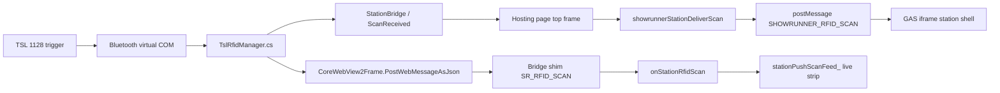

# TSL desktop station — new-chat handoff

**Purpose:** Paste or point the next Cursor chat at this file so it can pick up TSL 1128 desktop work without re-discovering the whole thread.

**Parent campaign:** [rfid-station-profiles.md](rfid-station-profiles.md) · **App readme:** [station-desktop/README.md](../../../station-desktop/README.md) · **Vendor reference only:** [stage-desktop-info/README.md](../../../stage-desktop-info/README.md)

**Last updated:** 2026-07-11 · **Director habit:** always launch via **`station-desktop/RUN-STATION.bat`** (never double-click a random exe in an old publish folder).

---

## One-line brief for a new chat

> TSL 1128 desktop gate PC (`tsl_dock_desktop` profile). App = `station-desktop/` WebView2 thin shell. **Always start with `RUN-STATION.bat`.** Current blockers: **gun not connecting on boot (again)** and **app exit does not sleep/disconnect the gun**, leaving COM3 locked. Live RFID strip relay was fixed in v0.1.24 / GAS v516 but connect/disconnect reliability is still open. Read this file + `TslRfidManager.cs` + `MainWindow.xaml.cs` before changing code.

---

## How the director runs the app (important)

The director **always** starts the station this way:

```text
station-desktop/RUN-STATION.bat
```

What the bat does:

1. `taskkill /F /IM ShowrunnerStationDesktop.exe` — kills stale copies (critical; two instances fight for COM3 → “Access denied”).
2. `ping` delay (~2 s) — lets Windows release the Bluetooth virtual COM port.
3. Starts **`ShowrunnerStationDesktop\bin\publish\win-x64\ShowrunnerStationDesktop.exe`** (canonical build output).

**Do not** launch from `win-x64-launch`, `win-x64-v019`, `win-x64-v020`, or an old zip — those were debug/legacy folders and caused version confusion (e.g. running v0.1.17 while thinking v0.1.23 was live).

---

## Versions (as of 2026-07-11)

| Layer | Version | Notes |
|-------|---------|--------|
| **GAS (web app)** | **516** | Includes live-feed-before-dedup + desktop bridge poll fix in `11_Station_Shell.html` |
| **Desktop EXE** | **0.1.25** | Graceful exit sleep+disconnect; connect sweep timeout; dispose audit log |
| **Hosting** | `sm-showrunner-97405.web.app` | Firebase shell; `host-boot.js` defines `showrunnerStationDeliverScan` |
| **TSL profile layout** | `tsl_dock_desktop` | Assigned in admin station profiles to this device account |
| **Chainway APK** | separate track | `station-android/` — not this handoff |

Build desktop:

```bash
node build-station-desktop.js "<release notes>"
```

Output: `station-desktop/ShowrunnerStationDesktop/bin/publish/win-x64/`

Deploy GAS (only when shell/backend JS changes):

```bash
node milestone.js "<note>"
```

---

## Folder map (do not confuse)

| Path | Role |
|------|------|
| **`station-desktop/`** | **The Showrunner desktop app** — WPF + WebView2 + TSL COM |
| **`stage-desktop-info/`** | TSL vendor PDFs, SDK samples, Explorer installer — **reference only**, not the app |
| **`station-android/`** | Chainway handheld APK — different gun, same web shell |
| **`push-hosting/public/`** | Firebase hosting shell (`index.html`, `host-boot.js`) |
| **`11_Station_Shell.html`** | GAS station UI (compiled into LogicPayload) |

---

## Architecture (how scans are supposed to flow)



**Key idea:** Showrunner’s station UI runs **inside a cross-origin GAS iframe** (`#app-frame`). The native host object (`window.AndroidStation`) is injected per frame, but **`PostWebMessageAsJson` from the host only reliably updates the top hosting document’s cache**. The GAS iframe must receive scans via:

1. **Primary (v0.1.24):** `CoreWebView2Frame.PostWebMessageAsJson({ type: 'SR_RFID_SCAN', tag, tid })` → bridge shim in iframe → `onStationRfidScan`.
2. **Backup:** top frame `showrunnerStationDeliverScan` → `postMessage` into `#app-frame`.
3. **Legacy / weak:** `ExecuteScriptAsync` into child frames (often hit wrong frames — Firebase, etc.).

**Desktop must not poll on the top hosting frame** — `host-boot.js` skips top-frame poll on WebView2 so it doesn’t drain the native queue before the iframe sees scans.

---

## Machine state (director’s PC, last known)

| Item | Value |
|------|--------|
| Gun model | TSL 1128-EU |
| Bluetooth COM | **COM3** (outgoing port — confirmed working when connect succeeds) |
| Prefs file | `%LOCALAPPDATA%\ShowrunnerStation\desktop-prefs.json` |
| Typical prefs | `"ComPort": "COM3"` (can leave blank for auto-detect by `PID_1128`) |
| Recurring failure | **Access denied / connect fail** when a previous process or unclean exit still holds COM3 |
| Recurring failure | **Two exe instances** fighting for the same port |

---

## Problem history (what this chat already went through)

### Fixed (do not regress)

| Symptom | Root cause | Fix (approx version) |
|---------|------------|----------------------|
| Connect failed / hourglass | Sync `hostObjects` blocked UI during COM connect; read gate blocked connect | Cache-only bridge shim; connect on watchdog thread (v0.1.21–22) |
| App instant exit on launch | `PushGunStateToWeb` touched WebView off UI thread | UI-thread-only gun push (v0.1.23) |
| Two apps on COM3 | Stale exe + no single-instance | `ProcessGuard`, `RUN-STATION.bat` taskkill, mutex (v0.1.20–21) |
| Folder confusion | Typo folder `station-desctop` vs real app | Renamed vendor folder to **`stage-desktop-info/`** |
| Live strip empty while F12 shows reads | Scans never reached GAS iframe reliably | Frame `PostWebMessage` + shim `SR_RFID_SCAN` (v0.1.24 / GAS 516) |
| Irrational double trigger | TSL double switch events + read overlap | Debounce 2200 ms; ignore trigger while read gate busy (v0.1.24) |

### Open (prioritize in next session)

| Symptom | Likely cause | Suggested direction |
|---------|--------------|---------------------|
| **Connect still flaky after v0.1.25** | Gun asleep; BT stack slow; zombie thread after sweep timeout | Check `connect-sweep-timeout` in connect-lock.log; pull trigger; verify `dispose-done` on close |
| Live strip still empty after v0.1.24 | Field still on old exe, or GAS cache, or station shell not mounted | F12 probe: `FRAME[n] isStation/hasOnScan/recentScans`; confirm v0.1.25 + GAS 516 |

---

## Key source files

| File | Responsibility |
|------|----------------|
| `station-desktop/RUN-STATION.bat` | **Director’s launch path** — taskkill + start `win-x64` exe |
| `station-desktop/ShowrunnerStationDesktop/MainWindow.xaml.cs` | WebView2 boot, frame tracking, `DeliverScanToPage`, bridge shim, F12 diagnostics |
| `station-desktop/ShowrunnerStationDesktop/TslRfidManager.cs` | COM connect watchdog, trigger reads, `SleepAndDisconnect`, `Dispose` |
| `station-desktop/ShowrunnerStationDesktop/StationBridge.cs` | WebView2 host object (`AndroidStation` API) |
| `station-desktop/ShowrunnerStationDesktop/GunPortDetector.cs` | Auto-detect TSL `PID_1128` outgoing COM |
| `station-desktop/ShowrunnerStationDesktop/ProcessGuard.cs` | Kill sibling exe on startup |
| `push-hosting/public/host-boot.js` | `showrunnerStationDeliverScan`, desktop skip top poll |
| `11_Station_Shell.html` | `onStationRfidScan`, live feed, `stationNativeBridge_`, scan poll |
| `build-station-desktop.js` | Publish to `bin/publish/win-x64` |

---

## Diagnostics (F12 in the desktop app)

Press **F12** to toggle the diagnostic window.

**Healthy scan (v0.1.24+):**

```text
[NATIVE] ScanReceived event EPC=...
[WEB] DeliverScanToPage EPC=...
[WEB] immediate: top relay + postMessage sent
[WEB] immediate: SR_RFID_SCAN → N frame(s)
[GUN] Read: ... tid:...
```

Use the probe button (or startup probe) — look for:

```text
TOP  { role:'top', deliverFn:true, appFrame:true, ... }
FRAME[0] { role:'child', isStation:true, hasOnScan:true, recentScans:1, ... }
```

If `hasOnScan:false` on all frames, the station shell hasn’t mounted yet (async GAS boot) or device isn’t in station mode (UA / profile).

Connect logs use `ConnectLockLog` / `[GUN]` / watchdog messages — grep `connect-try`, `connect-fail`, `connect-ok`, `Access denied`.

---

## Exit / disconnect behaviour (v0.1.25)

**Explicit sleep (works):** station settings → Disconnect+sleep → `SleepAndDisconnect()` → ASCII `.sl` then `Disconnect()`.

**App close (v0.1.25):** `MainWindow.ShutdownRfid()` → `TslRfidManager.ShutdownGracefully(3000ms)` — sends sleep, disconnects COM, logs `dispose-start` / `dispose-done` (or `dispose-timeout`) synchronously to `connect-lock.log`. Also hooked on `Application.SessionEnding`.

**RUN-STATION.bat taskkill** still skips graceful shutdown if a stale copy is killed — prefer closing the window normally before relaunching.

---

## What not to do

- Do not edit `stage-desktop-info/` expecting it to change the app — it’s vendor reference only.
- Do not run multiple `ShowrunnerStationDesktop.exe` copies (use the bat).
- Do not use old publish folders (`win-x64-v019`, `win-x64-v020`, `win-x64-launch`) as the field exe.
- Do not reintroduce **sync** `hostObjects.sync.androidStation.pollScans()` on the UI thread in the GAS iframe — caused hourglass / freeze.
- Do not “fix” scan relay in `host-boot.js` in a way that breaks phone QR scan — read [FRAGILE_ZONES.md](../FRAGILE_ZONES.md) § Two-layer shell bridge first.

---

## Suggested priority for next implementation session

1. **Clean exit** — sleep + disconnect on app close (with timeout); verify COM3 released and gun sleeps.
2. **Connect on boot** — after exit fix, retest; if still failing, improve watchdog logging and manual COM fallback UX.
3. **Verify live strip** — one trigger → EPC in strip + probe `recentScans:1` (regression check after connect work).
4. **Doc hygiene** — update version line in [rfid-station-profiles.md](rfid-station-profiles.md) header when shipping.

Say **OK go** in the new chat before code changes (director workflow).

---

## Copy-paste starter for a new Cursor chat

```text
Read docs/ai/active/tsl-desktop-handoff.md first.

TSL desktop station — I always launch with station-desktop/RUN-STATION.bat.

Current problems:
1. Gun not connecting on app start again.
2. Last time I closed the app the gun did not disconnect/sleep.

Please diagnose connect logs and the exit/disconnect gap (Task.Run Dispose with no wait).
Do not code until I say OK go.
```

---

## Session changelog (2026-07-11)

- **v0.1.25:** Graceful exit — `ShutdownGracefully(3s)` sends TSL sleep + disconnect on window close / logoff; `dispose-*` lines in connect-lock.log; connect sweep timeout (7s max per watchdog pass).
- **v0.1.24:** `PostScanToChildFrames` via `CoreWebView2Frame.PostWebMessageAsJson`; bridge shim handles `SR_RFID_SCAN`; trigger debounce 2200 ms; `RUN-STATION.bat` → `win-x64`.
- **GAS v516:** `stationPushScanFeed_` before dedup; `stationNativeBridge_` skips sync host when `__srDesktopBridge` present.
- **Not verified in field after deploy:** connect reliability + live strip on director’s machine (connect failed before retest).
